# 1.1 UNO Game Clone Overview

**Overview written by Peter Mitchell.**

## Contents

```
1.1 UNO Game Clone Overview 
1.2 Introduction
1.3 The Rules of UNO 
1.4 High Level Discussion About Implementation 
1.5 How the Core Game Works
1.6 Known Issues and Potential Improvements
```
# 1.2 Introduction

This document will cover the basic introduction showing off the UNO game. The entire game has been 
written with no sprites using draw calls in Java to render everything to the screen. You can start 
the application from Game.java if you are compiling the code yourself.

- ([Youtube Demo](https://youtu.be/6feJMIqSF98))

# 1.3 The Rules of UNO

The Rules for UNO have all been designed based on referencing the wording used on the UNO Wikipedia page <https://en.wikipedia.org/wiki/Uno_(card_game)> and based on the official UNO available on Steam <https://store.steampowered.com/app/470220/UNO/>.

With everything disabled for the options, the base game should mimic the core base game. The 
rules that can be added include: stacking +2/+4 cards, draw till a card can be played, for 
two player reverse becomes a skip, Seven-0 makes the 7 become a swap with target player and 0
 becomes everyone passing their cards to the next player, Jump In to change the turn order 
 dynamically, forced play to require playing of drawn cards if they can be, no bluffing to 
 remove any challenging of Draw Four cards, and custom score limits to determine the number 
 of rounds.

# 1.4 High Level Discussion About Implementation

In this section the game content will be described briefly mostly by showing image examples of
gameplay. This readme can't show off everything, but should give a good idea of the types of 
features that have been included. Some of the graphics are static and others are gifs to show
some of the animation sequences that occur as part of the game.

The first image shown below demonstrates the entry point for the application. The user is
immediately shown a game creation screen with many options. 

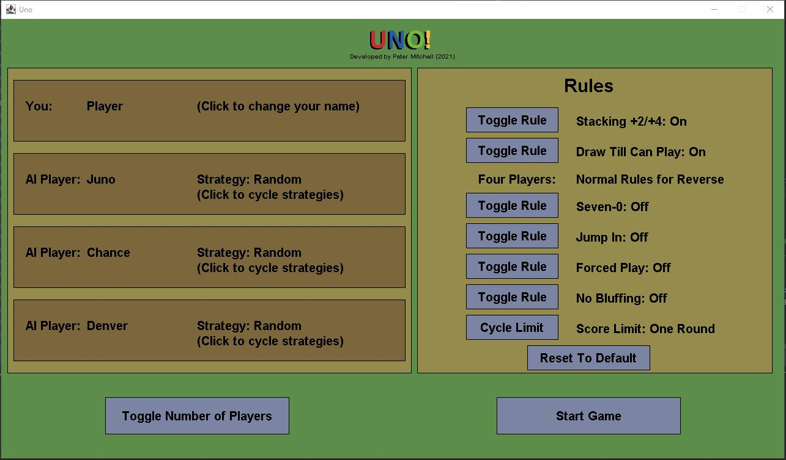

The options included all expected rules with some minor constraints. The rules you can change
include the following with the toggle buttons on the right:
- Stacking +2/+4: (On or Off), when on you can respond to a +2 or +4 with the same type of card. The penalty stacks onto the next person.
- Draw Till Can Play: (On or Off), when drawing from the deck as an action this forces drawing until a playable card is drawn.
- Two/Four Players: Reverse becomes a skip if playing in two player mode (as seen below too).
- Seven-0: (On or Off), when on the 7 becomes swap with a target player, 0 becomes all players pass their hands to the next player.
- Jump In: (On or Off), allows jump in actions during other players turns if you have a card that exactly matches the one in play.
- Forced Play: (On or Off), forces playing of the card drawn from the deck if it is possible during a draw turn action.
- No Bluffing: Disables challenging of the Draw 4.
- Score Limit: Cycles through the options (One Round, 200 Points, 300 Points, 500 Points, Unlimited) and controls what happens on the end screen.

The other buttons available in the screen include "Toggle Number of Players" to toggle between 2 and 4 players. This automatically changes the rules for the two/four player rule. For each of the players they can be clicked as well. Clicking on your player at the top allows you to change your name. The AI player names are all randomly generated from a list. Clicking on any of the AI will cycle through strategies including (Random, Offensive, Defensive, and Chaotic). Random plays any random action they can play as a valid move, Offensive plays to hold onto high value cards (particularly draw 4s) till the end of their hand, Defensive plays high value cards first to minimise the score awarded to a winner if they lose, and Chaotic changes between Offensive and Defensive strategies. The final two buttons on the screen are the "Reset To Default" that resets all the rules to the recommended options where only the stacking and draw till can play rules are on with a limit of one round, and the "Start Game" button to begin the round with the specified options.

The image below shows another view of the options with only two players, and all the options toggled to on states.

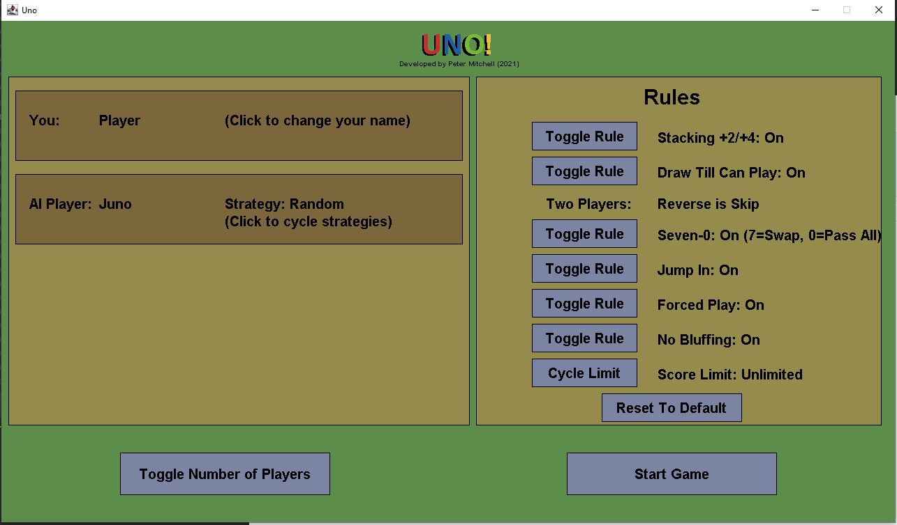

When the game is started the below is a typical view of the game. Showing the four players with names near their associated hands. A yellow/orange name colour indicates the current active turn player. The other player hands are not interactable, but hovering over your own cards will raise the currently hovered card as can be seen with the red 4 in the player's hand. The dots seen around the cards in the middle rotate to show the order of player (this will be clearer in the upcoming gifs). You can see the deck to the left of the card pile. The card pile in the middle shows the top card and randomly scattered previously played cards below it.

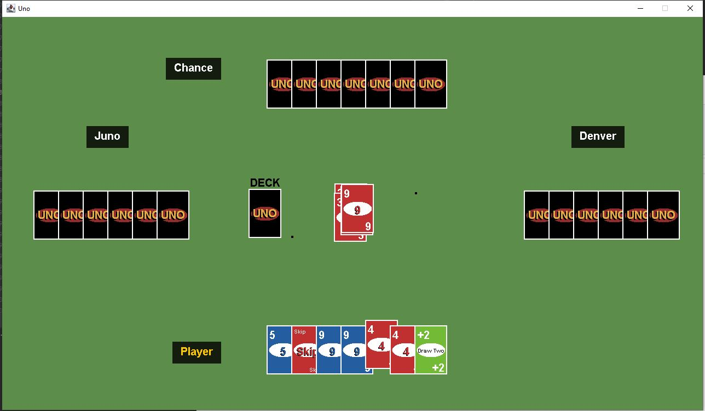

From this game state you can see the playing the skip card forces the player next in the turn order to be skipped. The player after Juno apparently did not have anything they could play, so you can see them rapidly draw many cards. Having to draw many cards is a result of the "Draw Till Can Play" rule that requires a player drawing from the deck continues to draw until something is playable. Then they can choose to keep or play the card. In this case, Chance decided to play the wild card and selected green as the colour. The messages that appear in the middle of the play space are clearly showing who is currently performing a required action in response to a card and what decision they are having to make. 

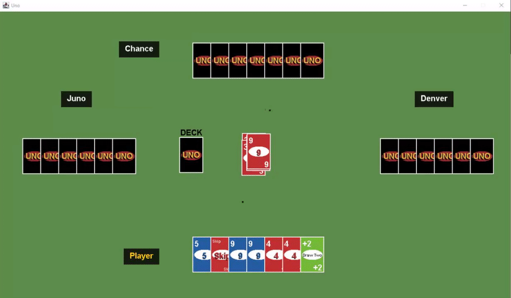

Continuing from the same game state as was shown above, the player Denver decided to play a green 9. The player then selected to play a Draw Two card and was punished for doing so. You can see as the players think in sequence as apply the Stacking rule to chain +2 cards until it reaches the player again. If the player had another +2 card they could have continued the chain, but as there was no response the cycle was ended with the player drawing +8 (+2 * 4) cards.

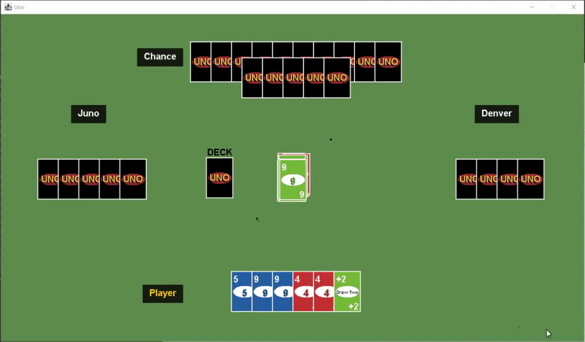

Below can be seen the use of a Reverse card. You can see the dots circling the middle of the screen change in response for a moment. Then the player Juno who only has two cards remaining calls UNO! and plays their own Reverse card sending it back to the player again.

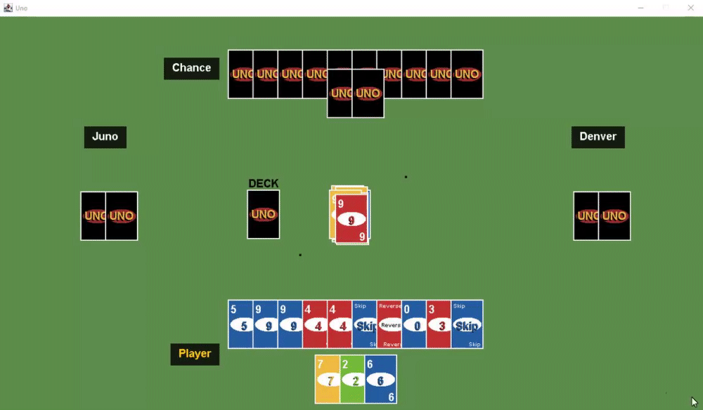

Following after the previous gif the player Juno won on their next turn. You can see the result shown below with a Post-Game Summary showing the score for the round. In the case of playing with a score limit or unlimited the round score would be tallied against the total score and you would continue on to the next round. In this case because it was set to a One Round score limit the choices are only to either Return to Lobby and choose new settings to play with, or to start a New Game Same Settings that will create a fresh game with all the same configuration.

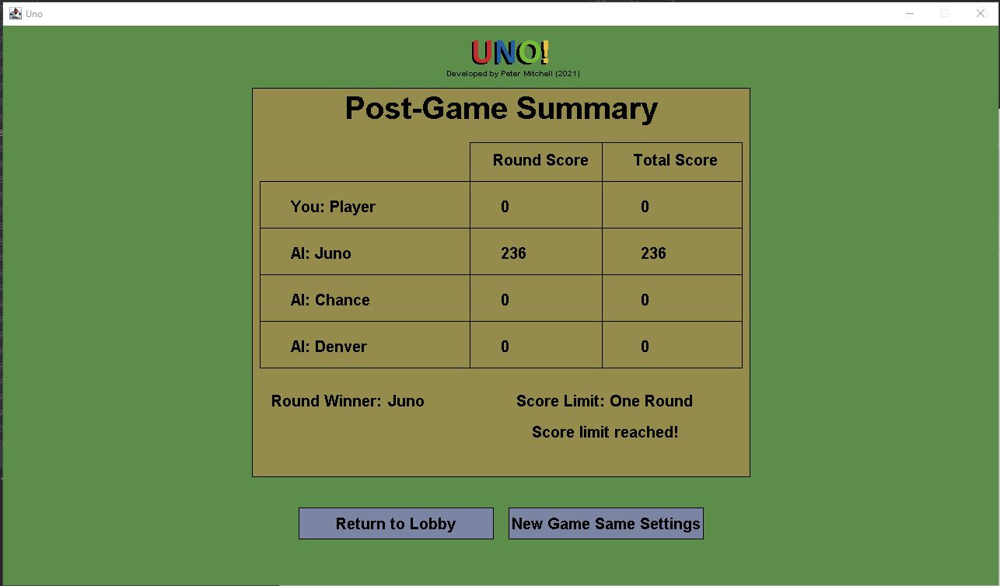

Below you can see an example of what choosing a response to a Draw Four card looks like. As long as they No Bluffing rule is off, the player can respond by either choosing to Challenge or Decline. If the previous player could have played a card they have to draw four cards, alternatively if they could not they player then has to draw 6 cards as a penalty. Declining will always draw just the four cards. This does become a bit more complicated if there are any Draw Fours in the player's hand because they could also choose to respond by stacking a Draw Four of their own. 

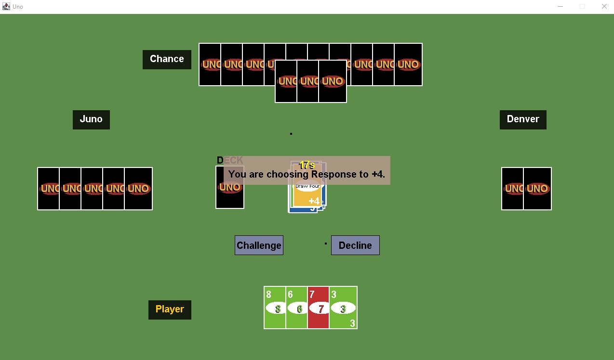

Below is a gif showing what happens if you fail to call UNO! fast enough. You can call it any time during the turn when you would be playing the second last card in your hand. You can also call it for a moment after playing the card, but the AI will not give you very long to do it. They may choose to call you out on failing to call it in time. That is what can be seen happening below where the 7 is played and the player goes to call UNO! after already playing the card, but is called out for not doing it fast enough. This is shown visually with a flashing exclamation mark over the player and the drawing of 2 cards for penalty.

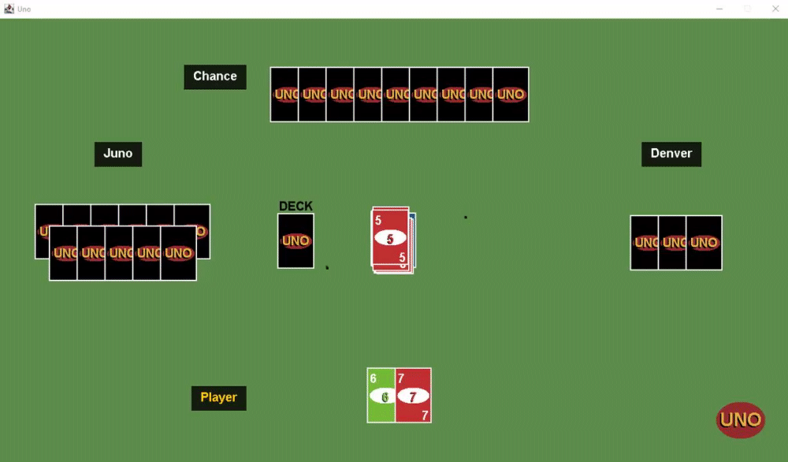

The below image shows an example of the interface shown when choosing to keep or play a card after drawing from the deck. Selecting Keep would keep the card in the hand (already shown at the right side of the hand below). Otherwise pressing Play will play that the card and perform any necessary additional actions depending on the card.

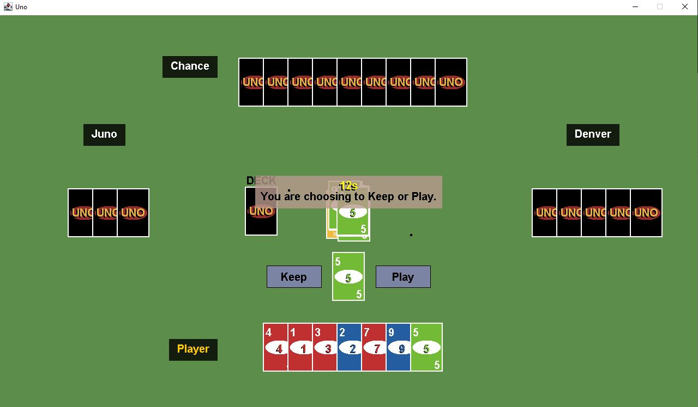

The below gif shows correctly pressing the UNO button prior to playing the second last card in the player's hand. You can see the flashing UNO! appear over the player and then the card from the player's hand is played successfully with no calling out happening as was shown previously.

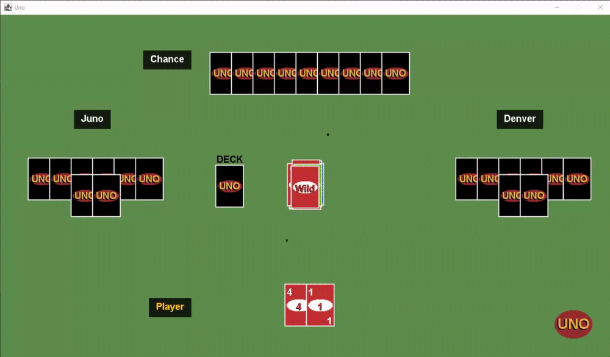

The below gif shows off an animation of the keep or play action with choosing to play a wild card. The wild card requires choosing of a colour that can be seen represented with the colour wheel. The region where the mouse is hovering over is moved out from the circle to indicate that is the current selection and clicking will confirm the colour.

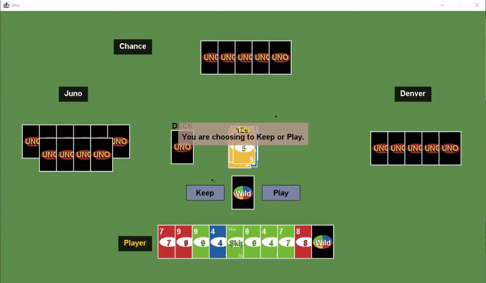

# 1.5 How the Core Game Works

In this section I will just briefly describe the purpose of all the classes included in the project and then explain the TurnAction system and its integration into the game. You will find that all files have been documented describing their purpose so you can look in the individual files for additional details about any feature.

Generic Classes:
- Position: Defines a position with an x and y coordinate.
- Rectangle: Defines a region of spec with a Position, width, and height.

Core Windows and Generic Interface Elements:
- Game: Simply an entry point to the application.
- GamePanel: A JPanel that manages the collection of virtual windows being displayed through all the application.
- CurrentGameInterface: An active game that is being played with cards on the field managed by players.
- LobbyInterface: Represents the interface for managing choices of number of players and the rule set before starting a game.
- PostGameInterface: The interface shown after a game has ended.
- PauseInterface: Shown when the game is paused with Escape. This shows debug commands and controls that can be used by the player.
- WndInterface: The generic interface used for all windows that are shown in the GamePanel.
- Button: Defines a simple button as a Rectangle that renders itself and can be checked for hovering/clicking.

Overlays Shown During Gameplay:
- OverlayManager: Manages the state of all overlays that are currently shown.
- AntiUnoButton: A more specialised button showing the ! to call out a player who did not call UNO.
- UnoButton: Another more specialised button for showing the UNO to call out UNO! with only 2 cards left.
- ChallengeOverlay: Poses the Challenge or Decline question for a Draw Four.
- ChallengeFailedOverlay: Flashes an X over the player who failed to challenge a Draw Four.
- ChallengeSuccessOverlay: Flashes a tick over the player who successfully challenged a Draw Four.
- GeneralOverlayInterface: An interface that defines a showOverlay() method used for overlays that only show something with no decision.
- TurnDecisionOverlayInterface: An interface that defines a showOverlay method with a reference to the TurnAction being used.
- KeepOrPlayOverlay: Poses the question to keep or play a card drawn from the deck.
- PlayDirectionAnimation: Perpetually shows two moving dots that circle the middle of the play area to show direction of play.
- PlayerFlashOverlay: Shows all the +X cards overlay flashes and any with text where the colour is all the same.
- StackChoiceOverlay: Prompts the user to choose to stack or decline and take the penalty.
- PlayerSelectionOverlay: Used for the Seven-0 rule when playing a 7 to choose the player to swap hands with.
- UNOCalledOverlay: Flashes UNO! over the player who called UNO.
- WildColourSelectionOverlay: Prompts the user to select a colour from the colour wheel to use as the wild colour.
- StatusOverlay: Shows a useful message indicating when any player is currently making a choice related to any of the other overlays mentioned above.

Other Classes:
- AIPlayer: Extends from a Player object and defines functionality to play as if they were a human player with no secret knowledge about the game state.
- Card: Defines a Card including the rendering of the card. 
- Deck: Defines a collection of Card objects that are ready to draw and shows visually the deck that can be clicked as an action.
- LobbyPlayer: A prototype for generating the Player or AIPlayer objects allowing the changing of configuration related to the name and strategy. Also responsible for visually representing the elements in the Lobby.
- Player: Defines a generic player that controls a collection of cards with methods for drawing and managing the cards in their hand.
- RuleSet: Defines the set of rules that can be used in a game. This is used for creation of the rules in the Lobby and then is kept for the current game for reference.
- TurnActionFactory: Used to generate the TurnAction sequences to control the flow of the game. 

That concludes the classes that are part of the game. It is worth speaking briefly about the implementation of TurnActionFactory and how it is being used to manage the game state. TurnActionFactory.java contains definitions of the data structure to construct linked list trees that can either perform an action or wait for a decision to occur. These are managed in the CurrentGameInterface class mostly by the updateTurnAction() method that is responsible for making any active turn action execute and then progress to the next state when it is ready. It is important that there is a concept of queued turn actions because when one chain of actions ends it can be continued with a new chain with some copied details from the previous one. It is important that the sequence of actions a player is responsible for are constrained to the playing of a single card. When a new card is played that starts a new queued chain. This keeps branching endless states constrained particularly in situations with stacking of cards. 

Everything begins for generating TurnAction trees by calling either TurnActionFactory.playCardAsAction(int playerID, int cardID, int faceValueID, int colourID) or TurnActionFactory.drawCardAsAction(int playerID). This mimics the entry points for what a player can do as the start of their turn and particularly for the playCardAsAction it will evaluate a lookup on the rules to determine what the associated action should be for that card. This allows dynamically changing the rules for cards like in the case of the Seven-0 rule. You can very easily get a debug output showing the constructed tree by calling for example: debugOutputTurnActionTree(TurnActionFactory.drawCardAsAction(0)); This would output:

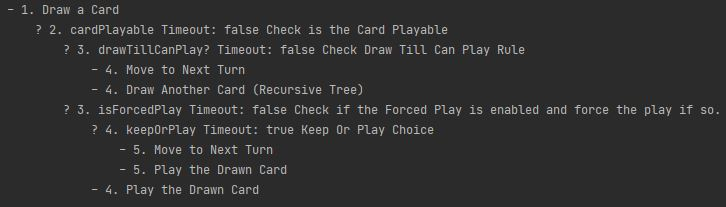

Getting output from debugging the playCardAsAction does require a CurrentGameInterface object to have been created with a RuleSet. You can enable debug mode and view the debug output of the currently played cards during the game as it plays. The largest tree is shown below with the entire tree of all steps involved in the playing of a Draw Four card. The tree includes comments in its construction allowing for generation of useful status information. To explain what is shown in this tree, each line is a separate TurnAction. The TurnActions that begin with a - are executed as actions and continued past without any pause. Those with a ? next to them indicate it is a decision node. These have two possible options splitting based on meeting a condition. The game state is held at these nodes until the condition is met. In some cases this is requiring input from the user or the AI to make a decision like a response to the card being played, or in other cases it is simply to split the decision tree based on a variable that is already set. This is commonly used for decision making based on rules.

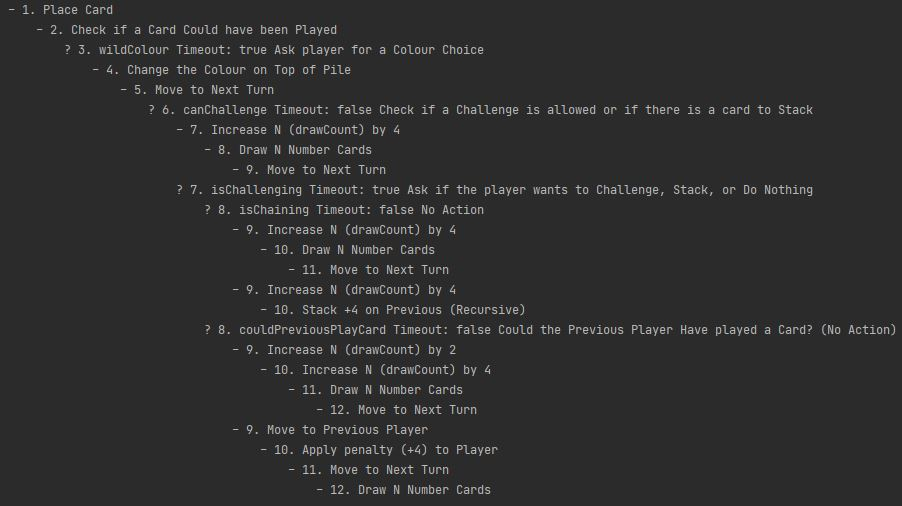

# 1.6 Known Issues and Potential Improvements

The following are just some of the issues that could be improved with the game as it is currently.
- If you are skipped with 1 card remaining the AI can call you out for not calling UNO forcing you to draw 2 cards.
- The UNO button will appear for 1 frame sometimes when you reach 2 cards in your hand from playing a third card.
- The timer currently does nothing when counting down during turn actions. All the enemy players are AI and will take their turns within about 3 seconds on average. If this game was to be shifted to multiplayer it would be necessary to enforce the timers. Running out on the timer would simply choose the default action for the current turn action.


