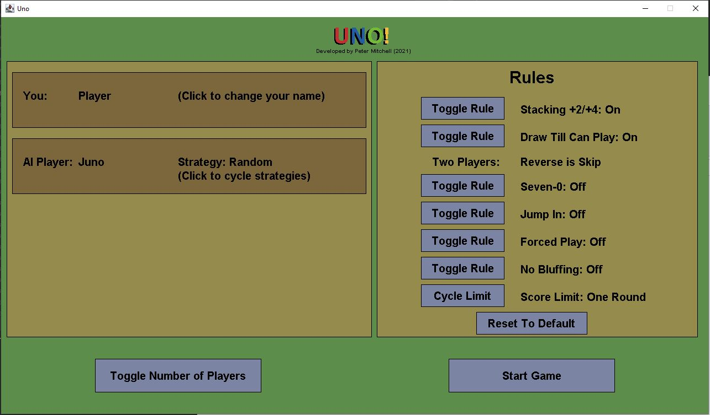

# 1.1 UNO Game Clone Overview

**Overview written by Peter Mitchell.**

## Contents

```
1.1 UNO Game Clone Overview 
1.2 Introduction
1.3 The Rules of UNO 
1.4 High Level Discussion About Implementation 
1.5 How the Core Game Works
1.6 Known Issues and Potential Improvements
```
# 1.2 Introduction

This document will cover the basic introduction showing off the UNO game. The entire game has been 
written with no sprites using draw calls in Java to render everything to the screen. You can start 
the application from Game.java if you are compiling the code yourself.

# 1.3 The Rules of UNO


# 1.4 High Level Discussion About Implementation

In this section the game content will be described briefly mostly by showing image examples of
gameplay. 





# 1.5 How the Core Game Works


# 1.6 Known Issues and Potential Improvements


